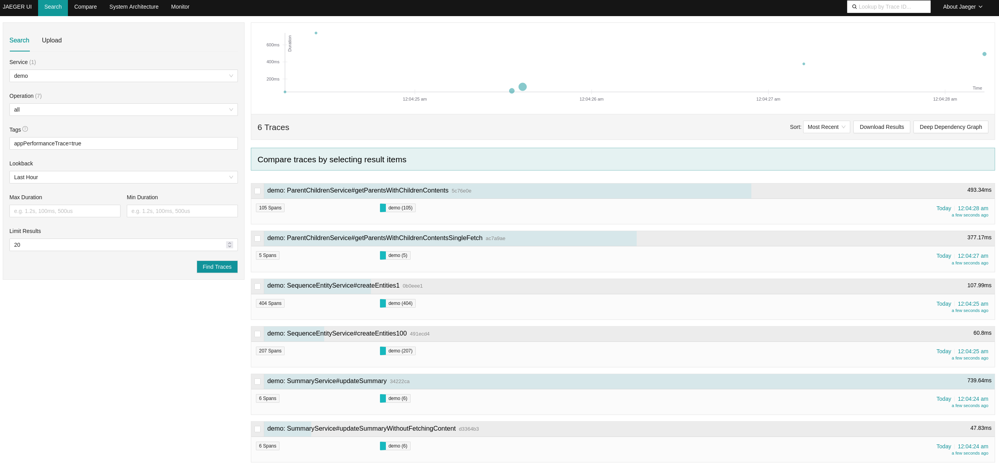
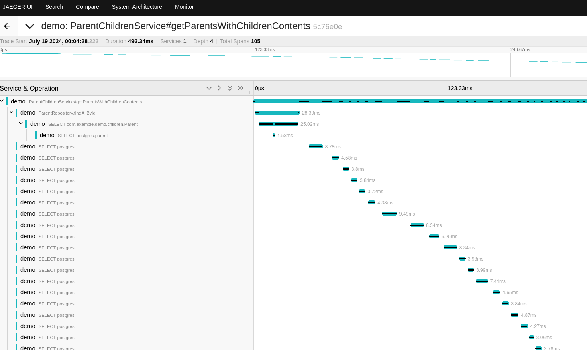
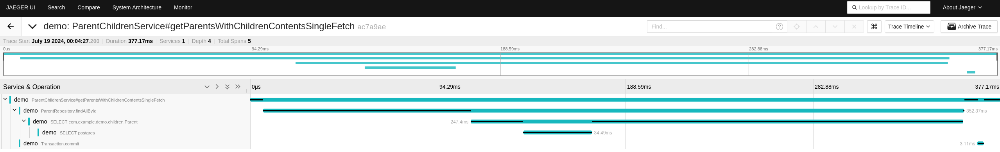
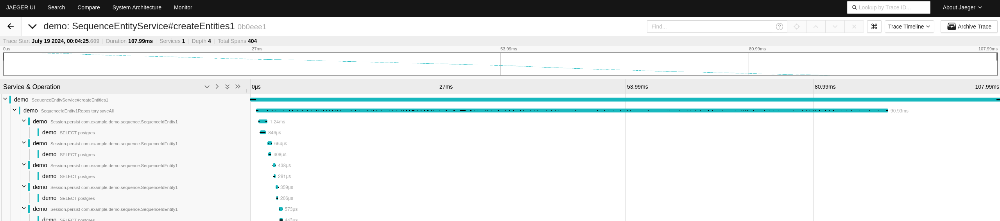
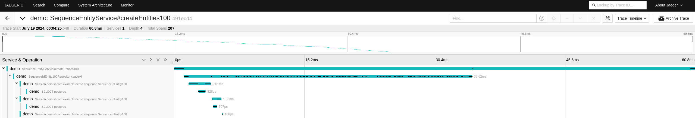
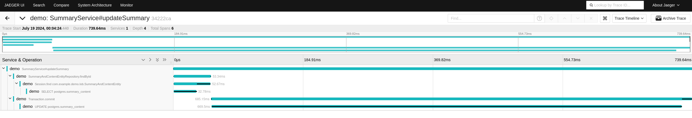
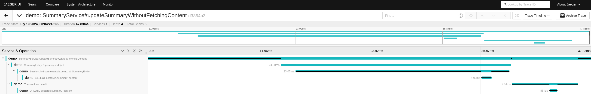

# tracing common ORM performance issues

## quick start

<https://opentelemetry.io/docs/instrumentation/java/>

```sh
# download java-agent for auto-instrumentation:
curl -L -O https://github.com/open-telemetry/opentelemetry-java-instrumentation/releases/latest/download/opentelemetry-javaagent.jar
```

```sh
# start database and tracing-backend
docker compose up

# activate the tracing-agent
source otel_activate.sh

# run some tests
./gradlew test --rerun-tasks
```

visit http://localhost:16686/search?service=demo&tags=%7B%22appPerformanceTrace%22%3A%22true%22%7D



## inefficient lazy loading of needed information (n+1)

issue: each access of a lazily loaded association triggers a new DB request



potential solution: fetch all needed information with one single DB request (e.g. via [spring-data-jpa-entity-graph](https://github.com/Cosium/spring-data-jpa-entity-graph))



## id-generation with insufficient sequence allocation-size

issue: each save of a newly created entity causes a DB request to obtain a new value from a sequence, causing 200 requests to obtain 200 ids (allocation-size 1)



potential solution: allocate larger chunks of the sequence with each DB request (potentially wasting unassigned ids of the range), causing 2 requests for 200 ids (allocation-size 100)



## unnecessarily fetching and updating large fields

issue: unnecessary mapping of large object fields



potential solution: separated mapping without large object fields


